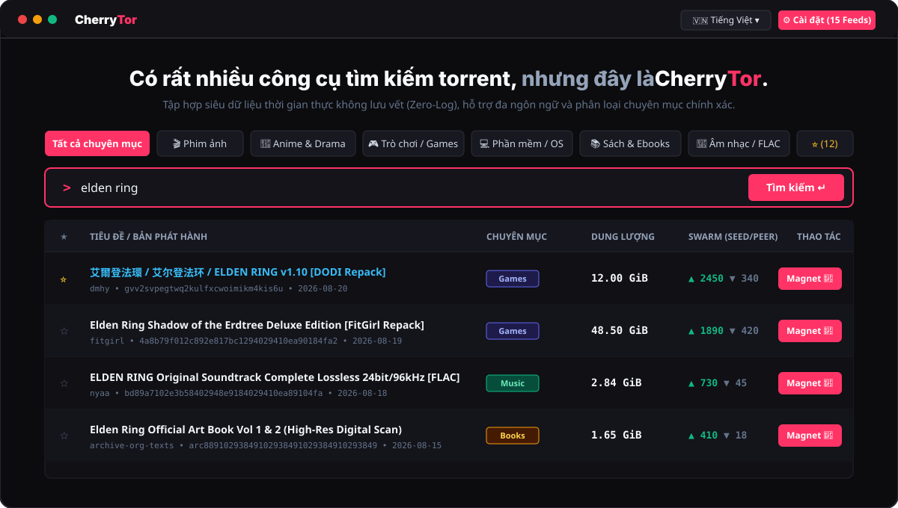

# 🌸 About CherryTor & Aeropad

> *"The Internet was founded on the principles of free information exchange and individual sovereignty. CherryTor and Aeropad exist to safeguard those fundamental ideals without compromise."*

---

## 🎯 The Mission

Modern search engines and torrent aggregators are plagued with pervasive tracking scripts, intrusive pop-up advertisements, malicious redirect chains, and surveillance logs tracking user IP addresses.

**CherryTor** was architected from the ground up to deliver a clean, lightning-fast, and strictly private alternative:

1. **Zero-Log Guarantee**: No search histories, IP addresses, queries, or user identifiers are ever recorded, stored in databases, or forwarded to third parties. Every query is executed in ephemeral Cloudflare Edge memory and destroyed immediately upon response delivery.
2. **Decentralized Multi-Source Aggregation**: Real-time federation across **15+ premier global swarm indexes** covering Asian drama/anime, international cinema, PC gaming repacks, lossless music, books, and open-source software.
3. **Sub-15ms Edge Performance**: Powered by Cloudflare Workers serverless isolates distributed across 300+ cities worldwide.
4. **Clean, Distraction-Free Design**: Zero ads, zero tracking pixels, zero analytics bloat. Just a high-density, keyboard-driven interface built for speed.

---

## 📝 Meet AeroPad: The 2FA Vault & Zero-Knowledge Security Studio

A core companion project in our ecosystem is **[AeroPad](https://aeropad.pages.dev/)** — an Apple-grade cryptographic security workspace and 2FA vault:

  

### Key Capabilities of AeroPad ([https://aeropad.pages.dev](https://aeropad.pages.dev)):
- **2FA Studio & Offline TOTP**: Generate and scan time-based one-time passwords (RFC 6238) with QR camera scanner entirely client-side without cloud leaks.
- **Smart Encrypted Notepad**: Client-side AES-GCM encrypted notes and cipher vault with biometric / master password protection.
- **Instant Magnet & Swarm Extractor**: Paste raw text, log files, or release notes. AeroPad extracts valid `magnet:?xt=urn:btih:...` URIs and infohashes for batch handoff.
- **100% Client-Side & Zero-Knowledge**: Keys and secret tokens never leave your browser isolate. Fully functional offline.

---

## 🏛️ Technical Architecture & Security Invariants

CherryTor is engineered around 10 non-negotiable security invariants:

| Invariant | Protection Mechanism |
| :--- | :--- |
| **INV-01 & INV-02** | **Anti-Proxy Strict Boundary**: Rejects any arbitrary `?target=` or `/proxy` parameter to prevent open-relay abuse. |
| **INV-03 & INV-10** | **Strict Upstream Allowlist**: Only pre-reviewed, HTTPS-only domains defined in `packages/providers/src/registry.ts` can be queried. |
| **INV-04 & INV-05** | **Structured Data Enforcement**: Rejects unstructured raw HTML payloads to protect against XSS and injection attacks. |
| **INV-06** | **Safe Scheme Validation**: Blocks malicious protocols (`javascript:`, `data:`, `file:`) in magnet links. |
| **INV-07** | **Edge Rate Limiting**: Enforces a 600 req/min sliding-window limit per IP to guard against denial-of-service. |
| **INV-08** | **Zero Client Secrets**: No API keys or credentials stored in client-accessible bundles. |
| **INV-09** | **P2P Transparency**: Explicit disclosure of swarm characteristics and public IP visibility on P2P networks. |

---

## 🌐 Supported Upstream Providers

CherryTor queries 15+ verified providers in parallel:

- **🌸 Asian Media & Anime**: 动漫花园 (DMHY), Nyaa.si, ACG.RIP, 萌番组 (Bangumi), Tokyo Toshokan
- **🎬 Global Cinema & Television**: The Pirate Bay (Apibay), YTS (HD/4K), EZTV (Series), SolidTorrents (DHT)
- **🎮 Gaming & Repacks**: FitGirl Repacks, DODI Repacks
- **💻 Software & Operating Systems**: LinuxTracker, Internet Archive Software
- **📚 Books & Literature**: Internet Archive Texts & Ebooks
- **🎵 Music & Lossless Audio**: Internet Archive Audio, High-Res FLAC Feeds

---

## 🌍 Internationalization (i18n)

Both CherryTor and Aeropad natively support 6 major languages:
- 🇻🇳 **Tiếng Việt** (Vietnamese)
- 🇺🇸 **English** (International)
- 🇨🇳 **中文** (Simplified Chinese)
- 🇯🇵 **日本語** (Japanese)
- 🇰🇷 **한국어** (Korean)
- 🇮🇩 **Bahasa Indonesia** (Indonesian)

---

  <em>Built with ❤️ and distributed under the permissive MIT License.</em> 
  <strong>CherryTor:</strong> <a href="https://cherrytor.io.vn">https://cherrytor.io.vn</a> &bull; <strong>Edge Mirror:</strong> <a href="https://tor.oaichuhust.workers.dev">https://tor.oaichuhust.workers.dev</a> &bull; <strong>AeroPad:</strong> <a href="https://aeropad.pages.dev/">https://aeropad.pages.dev/</a>

