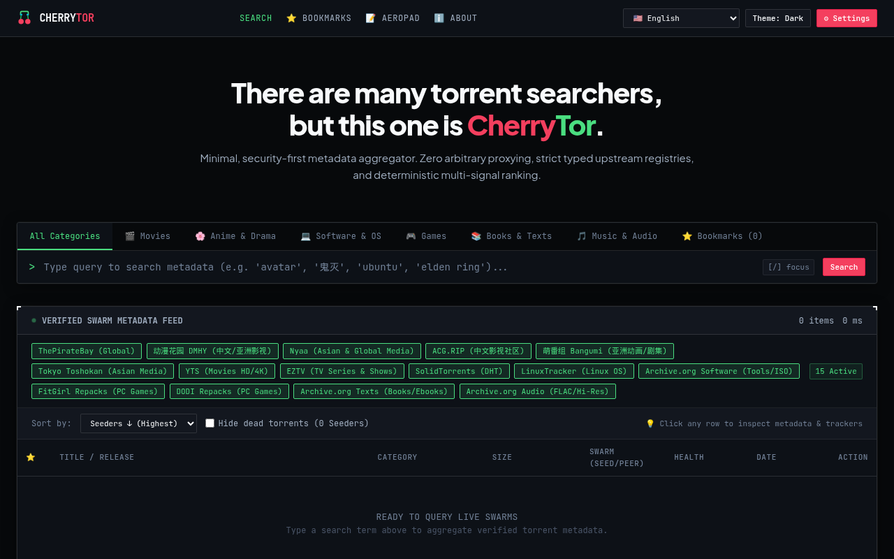
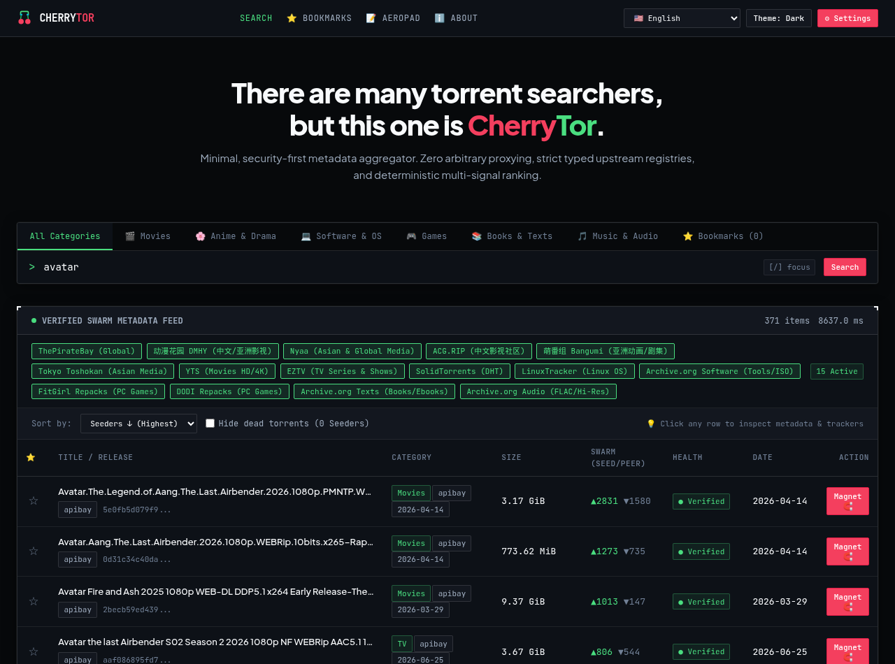
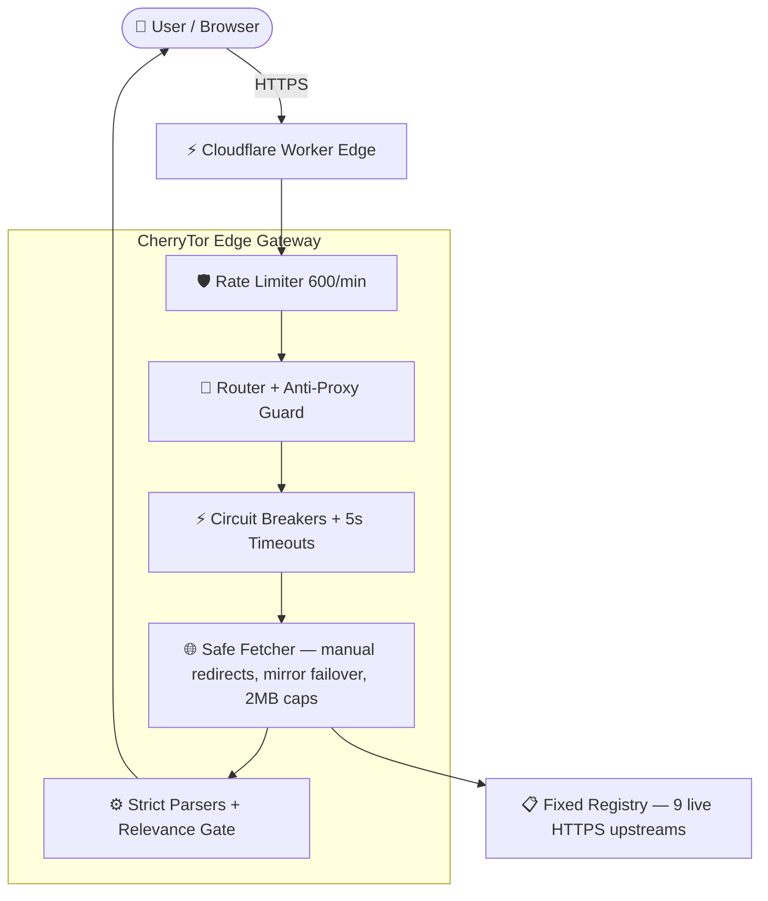

<p align="center">
  
</p>

<h1 align="center">🍒 CherryTor</h1>

<p align="center">
  <strong>The security-first, zero-log BitTorrent metadata search engine.<br/>One query — nine live upstream indexes — global edge latency.</strong>
</p>

<p align="center">
  <a href="https://cherrytor.io.vn"></a>
  <a href="https://github.com/oaichu/CherryTor/actions/workflows/ci.yml"></a>
  
  <a href="LICENSE"></a>
</p>

---

## 🌟 Why CherryTor?

> *"There are many torrent search engines, but this one is CherryTor."*

Legacy torrent portals bury you in pop-ups, redirect chains, mining scripts and IP-grabbing trackers. CherryTor is the opposite: a **minimal, audited, serverless gateway** that federates the world's public torrent *metadata* and hands you clean, strictly-validated magnet links — nothing else.

- **Zero-log by construction** — queries live in ephemeral Cloudflare isolate memory and are destroyed on response. No accounts, no database, no analytics.
- **Not a proxy, ever** — the edge only calls a fixed, human-reviewed registry of HTTPS upstreams. Arbitrary `?target=` / `/proxy` requests are rejected at the door (INV-01/02).
- **Nothing executes in your browser** — every provider-controlled value (titles, magnet URIs, hashes) is rendered via `textContent` under a deny-by-default CSP. Upstream HTML is never relayed (INV-04).
- **Honest data** — swarm counts and dates come from the upstream feed or they don't appear at all. We never invent seeders, dates, or "verified" badges.
- **Per-source transparency** — every search shows exactly which index answered, returned zero, or failed. No silent result loss.

<p align="center">
  
</p>

---

## 🚀 Features

### 🔎 Aggregated multi-source search
One query fans out to every enabled index in parallel; results are merged, de-duplicated by infohash and relevance-filtered server-side, so firehose feeds that ignore keywords can never pollute your results.

| Source | Coverage | Format |
| :--- | :--- | :---: |
| **The Pirate Bay (apibay)** | Global movies / TV / music / games / software | JSON |
| **YTS** | HD & 4K movies | JSON |
| **EZTV** | TV series & shows | JSON |
| **SolidTorrents** | DHT-wide aggregation | JSON |
| **BitSearch** | DHT-wide aggregation | JSON |
| **Nyaa** | Anime & Asian media | RSS |
| **动漫花园 DMHY** | Chinese anime & drama | RSS |
| **Tokyo Toshokan** | Japanese anime & media | RSS |
| **LinuxTracker** | Linux ISOs & open-source | RSS |

*Every source must pass the [provider acceptance policy](PROVIDER_POLICY.md) (HTTPS-only, structured APIs, no scraping, no WAF/anti-bot bypass — INV-06) before it is enabled.*

### 🛡️ Security engineering, not marketing
- Strict RFC-BTIH magnet gate at the schema boundary — attribute-breakout and HTML-injection payloads are dropped at the edge before they ever reach a browser.
- Manual redirect handling with per-provider host allowlists; mirror failover on 403/429/5xx/HTML-challenge pages.
- 2 MB payload caps enforced on `Content-Length` *before* buffering; 5 s timeouts; per-provider circuit breakers; sliding-window rate limiting.
- Deny-by-default CSP, `X-Frame-Options: DENY`, `Referrer-Policy: no-referrer`.

### 🌍 20 languages, one click
🇻🇳 Tiếng Việt · 🇺🇸 English · 🇨🇳 中文 · 🇯🇵 日本語 · 🇰🇷 한국어 · 🇮🇩 Bahasa Indonesia · 🇪🇸 Español · 🇫🇷 Français · 🇩🇪 Deutsch · 🇷🇺 Русский · 🇧🇷 Português · 🇮🇹 Italiano · 🇹🇷 Türkçe · 🇵🇱 Polski · 🇺🇦 Українська · 🇸🇦 العربية · 🇮🇷 فارسی · 🇮🇳 हिन्दी · 🇧🇩 বাংলা · 🇷🇴 Română

### 🗂️ Client-side sorting & bookmarks
Sort by seeders, size, date or title; bookmark releases to `localStorage`; theme (dark/light), density and CRT modes — all stored **only** on your device. CherryTor records no search history at all.

### 📝 Companion: AeroPad 2FA Vault
Our sister app **[AeroPad](https://aeropad.pages.dev/)** is a zero-knowledge security studio: RFC-6238 TOTP 2FA, AES-GCM cipher vault, and a magnet/infohash batch extractor — 100% client-side.

---

## 🏛️ Architecture



Full trust-boundary model: [THREAT_MODEL.md](THREAT_MODEL.md) · [docs/architecture.md](docs/architecture.md) · Invariants: [SECURITY.md](SECURITY.md)

---

## 💻 Self-hosting

```bash
git clone https://github.com/oaichu/CherryTor.git
cd CherryTor

pnpm install
pnpm typecheck     # strict TypeScript
pnpm test          # full unit + integration + security suite (Node ≥ 22.6)

pnpm deploy        # ships to your Cloudflare account (free tier works)
```

Requirements: Node ≥ 22.6 (for `--experimental-strip-types`), pnpm ≥ 9, a Cloudflare account. Configure your routes in [`wrangler.toml`](wrangler.toml).

---

## 📡 Public API

### `POST /api/v1/search`

```json
{
  "provider": "yts",
  "query": "avatar",
  "category": "Movies"
}
```

Response — strictly-validated items only:

```json
{
  "data": [
    {
      "id": "yts-5ca4f8aae8ec1f422f9aad23908c94297c2cb882",
      "title": "Avatar Fire and Ash (2025) [1080p]",
      "category": "Movies",
      "sizeBytes": 3300467929,
      "seeders": 2461,
      "leechers": 1066,
      "infoHash": "5ca4f8aae8ec1f422f9aad23908c94297c2cb882",
      "magnetUri": "magnet:?xt=urn:btih:5ca4f8aa...",
      "sourceId": "yts",
      "publishedAt": "2025-12-20T01:42:44.819Z"
    }
  ],
  "errors": [],
  "meta": { "provider": "yts", "latencyMs": 623, "timestamp": "2026-08-22T08:37:19Z" }
}
```

Errors: `400` validation · `429` rate-limited · `502/504` upstream failure or circuit breaker open. Full contract: [specs/api.md](specs/api.md).

---

## 🔒 Security invariants (INV-01 … INV-10)

1. **INV-01/02** — no arbitrary target URLs; never an open proxy.
2. **INV-03** — upstream URLs are generated exclusively from the server-side registry.
3. **INV-04** — raw upstream HTML is never relayed to the browser.
4. **INV-05** — the production API speaks structured JSON only.
5. **INV-06** — no CAPTCHA / WAF / anti-bot bypass, ever.
6. **INV-07** — no browser-to-LAN RPC from the web client.
7. **INV-08** — zero credentials or secrets in client storage.
8. **INV-09** — P2P operations stay outside the search security boundary.
9. **INV-10** — unreviewed providers are disabled by default.

Every invariant is pinned by automated tests in [`tests/security/`](tests/security/). Found an issue? Please open a private advisory (Security tab) — responsible disclosure is welcome.

---

## ⚖️ Legal notice

CherryTor is a **metadata gateway**: it hosts, stores, caches and transmits no torrent files or media. Results are public infohashes and RFC magnet URIs resolved by the decentralized DHT network. Users are responsible for complying with the copyright and data-transmission laws of their jurisdiction.

---

## 📄 License

[MIT](LICENSE) © 2026 CherryTor Contributors.
