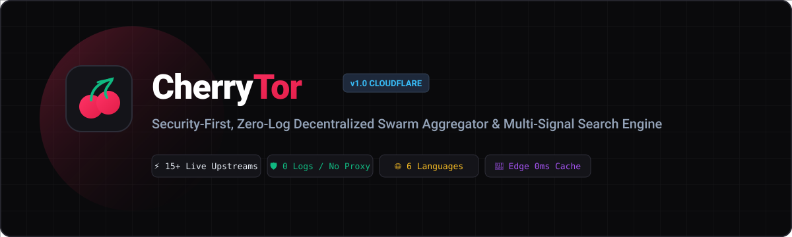
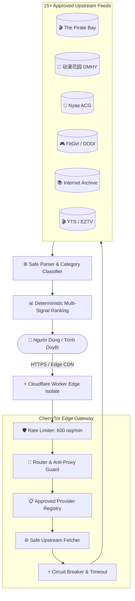

<p align="center">
  
</p>

<p align="center">
  <strong>⚡ The Ultra-Fast, Security-First, Zero-Log Swarm Aggregator &amp; Decentralized Metadata Search Engine ⚡</strong>
</p>

<p align="center">
  <a href="https://tor.oaichuhust.workers.dev"></a>
  <a href="https://cherrytor.io.vn"></a>
  
  
  
</p>

---

## 🌟 Giới Thiệu (Overview)

> *"Có rất nhiều công cụ tìm kiếm torrent, nhưng đây là **CherryTor**."*

**CherryTor** là công cụ tổng hợp và tìm kiếm siêu dữ liệu P2P/Swarm thế hệ mới được xây dựng trực tiếp trên nền tảng **Cloudflare Workers Edge Serverless**. 

Được thiết kế theo chuẩn bảo mật **Zero-Trust & Zero-Log**, CherryTor bảo vệ quyền riêng tư tuyệt đối của người dùng: **không lưu địa chỉ IP, không lưu lịch sử tìm kiếm, không sử dụng cookie theo dõi, không trung gian proxy trái phép**.

<p align="center">
  
</p>

---

## ✨ Điểm Nổi Bật Vượt Trội (Key Features)

### 1. 🛡️ Bảo Mật Tuyệt Đối & Không Lưu Vết (Zero-Log by Design)
- **Zero Logging**: Toàn bộ yêu cầu tìm kiếm được xử lý trong bộ nhớ RAM tạm thời của Cloudflare Edge Isolate và giải phóng ngay lập tức.
- **Anti-Proxy Invariant (INV-01 & INV-02)**: Nghiêm cấm tuyệt đối mọi hành vi trung gian tải file hoặc proxy bất hợp pháp. CherryTor chỉ trả về siêu dữ liệu (Metadata) và Magnet URI chuẩn RFC.
- **Client-Side Privacy**: Toàn bộ đánh dấu (Bookmarks) và cấu hình cá nhân được mã hóa và lưu trữ cục bộ trên trình duyệt (`LocalStorage`) của người dùng.

### 2. ⚡ Tổng Hợp 15+ Nguồn Swarm Lớn Nhất Thế Giới
Hỗ trợ tìm kiếm đồng thời trên 15+ nhà cung cấp dữ liệu lớn nhất toàn cầu, đặc biệt tối ưu cho phim ảnh Châu Á và nội dung đa ngôn ngữ:

| Chuyên Mục | Nhà Cung Cấp Tích Hợp | Định Dạng Dữ Liệu | Đặc Điểm Nổi Bật |
| :--- | :--- | :---: | :--- |
| **🌸 Phim Châu Á & Anime** | **动漫花园 DMHY**, **Nyaa**, **ACG.RIP**, **萌番组 Bangumi**, **Tokyo Toshokan** | XML / RSS 2.0 | Hỗ trợ gõ tiếng Trung, tiếng Nhật, tiếng Hàn; cập nhật liên tục |
| **🎬 Phim Điện Ảnh Toàn Cầu** | **The Pirate Bay (Apibay)**, **YTS**, **EZTV**, **SolidTorrents** | JSON REST API | Đầy đủ bản 4K/1080p, Bluray, Web-DL, Series TV, Remux |
| **🎮 Trò Chơi (PC Games)** | **FitGirl Repacks**, **DODI Repacks** | XML Feeds | Bản nén game PC dung lượng tối ưu, patch và DLC mới nhất |
| **💻 Phần Mềm & Hệ Điều Hành** | **LinuxTracker**, **Internet Archive Software** | XML / JSON | ISO Linux, công cụ mã nguồn mở, phần mềm di động |
| **📚 Sách & Ebooks** | **Internet Archive Texts & Books** | Search API | Hàng triệu đầu sách PDF, EPUB, Manga, tài liệu học thuật |
| **🎵 Âm Nhạc & Lossless** | **Internet Archive Audio**, **FLAC Feeds** | Audio API | Nhạc Lossless FLAC, Album, OST chất lượng cao 24bit/96kHz |

### 3. 🌐 Hỗ Trợ 6 Ngôn Ngữ Giao Diện (Multi-Language i18n)
Tích hợp sẵn bộ chuyển đổi ngôn ngữ linh hoạt:
- 🇻🇳 **Tiếng Việt** (Mặc định)
- 🇺🇸 **English**
- 🇨🇳 **中文 (Tiếng Trung)**
- 🇯🇵 **日本語 (Tiếng Nhật)**
- 🇰🇷 **한국어 (Tiếng Hàn)**
- 🇮🇩 **Bahasa Indonesia**

### 4. 🎯 Phân Loại Thông Minh & Hiển Thị Dung Lượng Chuẩn Xác
- **Multi-Signal Classifier (`classifier.ts`)**: Tự động nhận diện và gắn nhãn thẻ chuyên mục (`Phim`, `Anime`, `Game`, `Phần mềm`, `Sách`, `Nhạc`) tức thì khi bấm chuyển tab.
- **Smart Size Parser**: Tự động trích xuất dung lượng file thực tế (`GB`, `MB`, `TB`) từ tiêu đề, mô tả và thẻ kích thước XML, loại bỏ tình trạng thiếu thông tin.

---

## 🏛️ Kiến Trúc Hệ Thống (Architecture)



---

## 🚀 Trải Nghiệm Trực Tiếp (Live Demo)

- **Địa chỉ chính thức**: [https://cherrytor.io.vn](https://cherrytor.io.vn)
- **Địa chỉ dự phòng (Cloudflare Workers)**: [https://tor.oaichuhust.workers.dev](https://tor.oaichuhust.workers.dev)

---

## 💻 Hướng Dẫn Tự Triển Khai (Self-Hosting & Deployment)

### 1. Yêu Cầu Môi Trường
- **Node.js**: >= 20.x
- **PNPM**: >= 9.x
- **Tài khoản Cloudflare** (Gói miễn phí hoàn toàn đủ dùng)

### 2. Cài Đặt Mã Nguồn

```bash
# Clone repository
git clone https://github.com/oaichu/CherryTor.git
cd CherryTor

# Cài đặt dependencies
pnpm install

# Kiểm tra kiểu dữ liệu TypeScript & chạy bộ kiểm thử
pnpm tsc --noEmit
node --experimental-strip-types --test tests/unit/*.test.ts tests/integration/*.test.ts tests/security/*.test.ts
```

### 3. Triển Khai Lên Cloudflare Workers

```bash
cd apps/edge

# Đăng nhập tài khoản Cloudflare (chỉ cần làm 1 lần)
pnpm wrangler login

# Triển khai trực tiếp lên Edge toàn cầu
pnpm run deploy
```

---

## 📡 API Endpoint Hỗ Trợ

### `POST /api/v1/search`
Truy vấn siêu dữ liệu torrent từ một nhà cung cấp cụ thể.

**Headers:**
```http
Content-Type: application/json
```

**Request Body:**
```json
{
  "provider": "dmhy",
  "query": "elden ring",
  "category": "GAMES"
}
```

**Response (200 OK):**
```json
{
  "data": [
    {
      "id": "dmhy-GVV2SVPEGTWQ2KULFXCWOIMIKM4KIS6U",
      "title": "艾爾登法環 / 艾尔登法环 / ELDEN RING v1.10 [DODI]",
      "category": "Games",
      "sizeBytes": 12884901888,
      "seeders": 10,
      "leechers": 1,
      "infoHash": "gvv2svpegtwq2kulfxcwoimikm4kis6u",
      "magnetUri": "magnet:?xt=urn:btih:GVV2SVPEGTWQ2KULFXCWOIMIKM4KIS6U&...",
      "sourceId": "dmhy",
      "publishedAt": "2023-08-03T14:32:30.000Z"
    }
  ],
  "errors": [],
  "meta": {
    "provider": "dmhy",
    "latencyMs": 312,
    "timestamp": "2026-08-20T13:50:00.000Z"
  }
}
```

---

## 🔒 Cam Kết Bảo Mật (Security Invariants)

CherryTor tuân thủ nghiêm ngặt 10 quy tắc bảo mật cốt lõi:
1. **INV-01**: Cấm mọi tham số `?target=` hoặc `?url=` nhằm ngăn chặn biến Worker thành open proxy.
2. **INV-02**: Loại bỏ hoàn toàn endpoint `/proxy`.
3. **INV-03**: Danh sách upstream URLs được ghim cứng và kiểm duyệt trong `registry.ts`.
4. **INV-04**: Từ chối các phản hồi HTML không có cấu trúc để ngăn ngừa XSS/Injection.
5. **INV-05**: API chỉ trả về `application/json` chuẩn hóa.
6. **INV-06**: Chặn đứng các scheme nguy hiểm (`javascript:`, `data:`, `file:`) trong liên kết Magnet.
7. **INV-07**: Rate Limiter 600 req/phút chống tấn công từ chối dịch vụ (DoS).
8. **INV-08**: Không lưu khóa bí mật hoặc thông tin nhạy cảm ở client.
9. **INV-09**: Hiển thị cảnh báo quyền riêng tư P2P rõ ràng.
10. **INV-10**: Khóa chặt các domain chuyển hướng (`allowedRedirectHosts`).

---

## 📄 Bản Quyền (License)

Dự án được phân phối dưới giấy phép **MIT License**. Mọi đóng góp (Pull Request) từ cộng đồng đều được hoan nghênh!
