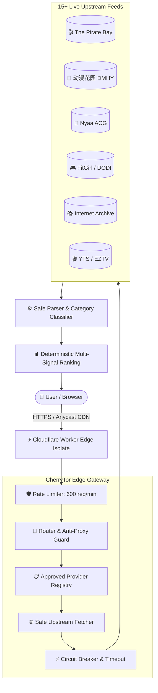

<p align="center">
  
</p>

<p align="center">
  <strong>⚡ The Ultra-Fast, Security-First, Zero-Log Swarm Aggregator &amp; Decentralized Metadata Search Engine ⚡</strong>
</p>

<p align="center">
  <a href="https://cherrytor.io.vn"></a>
  <a href="https://tor.oaichuhust.workers.dev"></a>
  <a href="https://aeropad.pages.dev/"></a>
  <a href="LICENSE"></a>
  
  
</p>

---

## 🌟 Introduction

> *"There are many torrent search engines, but this one is **CherryTor**."*

**CherryTor** is a next-generation, high-performance BitTorrent swarm metadata aggregator and search engine deployed globally across **Cloudflare Workers Serverless Edge**. 

Engineered with a strict **Zero-Trust & Zero-Log architecture**, CherryTor guarantees uncompromising privacy: **no IP logging, no search history tracking, no surveillance cookies, and zero arbitrary proxying**.

<p align="center">
  
</p>

---

## 🚀 Key Features

### 1. 🛡️ Absolute Privacy & Zero-Log Architecture
- **Zero Logging Guarantee**: All queries are processed strictly in ephemeral RAM within Cloudflare Edge Isolates and immediately discarded upon completion.
- **Anti-Proxy Invariant (INV-01 & INV-02)**: Strict protocol prevents arbitrary proxying or illegal file relaying. CherryTor serves verified swarm metadata and standard RFC Magnet links only.
- **Client-Side Data Sovereignty**: Bookmarks, history, and preferences stay 100% on your local device via browser `LocalStorage`.

### 2. 📝 Ecosystem Companion: AeroPad & 2FA Vault
Our official companion web application is **[AeroPad](https://aeropad.pages.dev/)** ([https://aeropad.pages.dev](https://aeropad.pages.dev)):
- **2FA Studio & Offline TOTP**: Generate and scan time-based one-time passwords (RFC 6238) with real-time QR camera scanning without cloud dependencies.
- **Client-Side AES-GCM Cipher Vault**: Store encrypted notes, seed phrases, and credentials protected by master encryption.
- **Instant Magnet & Swarm Extractor**: Paste unstructured text, logs, or release notes to automatically extract all valid `magnet:?xt=urn:btih:...` URIs and infohashes for 1-click batch export.
- **100% Client-Side Privacy**: Operates fully offline in your browser with zero server logs or tracking.

### 3. ⚡ 15+ Verified Global Upstream Feeds
Queries the world's most trusted public indexers in parallel with sub-second response times:

| Category | Supported Providers | Protocol / Format | Highlights |
| :--- | :--- | :---: | :--- |
| **🌸 Asian Media & Anime** | **动漫花园 (DMHY)**, **Nyaa**, **ACG.RIP**, **萌番组 (Bangumi)**, **Tokyo Toshokan** | XML / RSS 2.0 | Native Chinese, Japanese, Korean search with real-time updates |
| **🎬 Global Movies & TV** | **The Pirate Bay (Apibay)**, **YTS**, **EZTV**, **SolidTorrents** | JSON REST API | 4K/1080p BluRay, Web-DL, complete TV series, Remux |
| **🎮 PC Games & Repacks** | **FitGirl Repacks**, **DODI Repacks** | XML Feeds | High-compression PC game repacks, latest patches, and DLCs |
| **💻 Software & Operating Systems** | **LinuxTracker**, **Internet Archive Software** | XML / JSON | Linux ISO distributions, open-source software, portable tools |
| **📚 Books & Literature** | **Internet Archive Texts & Books** | Search API | Millions of free PDF, EPUB, Manga, and academic texts |
| **🎵 Music & Lossless Audio** | **Internet Archive Audio**, **FLAC Feeds** | Audio API | 24-bit/96kHz Studio Master FLAC, albums, soundtracks, OSTs |

### 4. 🌐 6-Language Localization (i18n)
Easily toggle between 6 fully localized languages from the navigation bar or settings:
- 🇻🇳 **Tiếng Việt** (Vietnamese)
- 🇺🇸 **English** (International)
- 🇨🇳 **中文** (Simplified Chinese)
- 🇯🇵 **日本語** (Japanese)
- 🇰🇷 **한국어** (Korean)
- 🇮🇩 **Bahasa Indonesia** (Indonesian)

### 5. 🎯 Smart Category Classifier & Accurate File Sizes
- **Multi-Signal Classifier (`classifier.ts`)**: Dynamically categorizes releases into Movies, Anime, Games, Software, Books, or Music.
- **Human File Size Parser**: Automatically extracts file sizes from XML tags, byte counts, or bracketed titles (e.g. `12.00 GiB`, `773.62 MiB`, `48.50 GiB`).

---

## 🏛️ System Architecture



---

## 🌐 Live Deployments

- **Official Web Address**: [https://cherrytor.io.vn](https://cherrytor.io.vn)
- **Direct Edge Mirror**: [https://tor.oaichuhust.workers.dev](https://tor.oaichuhust.workers.dev)
- **Companion 2FA Vault (AeroPad)**: [https://aeropad.pages.dev](https://aeropad.pages.dev)

---

## 💻 Quickstart & Self-Hosting

### 1. Prerequisites
- **Node.js**: >= 20.x
- **PNPM**: >= 9.x
- **Cloudflare Account** (Free tier is 100% sufficient)

### 2. Local Setup & Testing

```bash
# Clone the repository
git clone https://github.com/oaichu/CherryTor.git
cd CherryTor

# Install dependencies
pnpm install

# Type-check & Run full test suite (45/45 passing)
pnpm tsc --noEmit
pnpm test
```

### 3. Deploy to Cloudflare Edge

```bash
# Deploy globally in seconds via root or apps/edge
pnpm run deploy
```

---

## 📡 API Specification

### `POST /api/v1/search`
Query swarm metadata directly from approved providers.

**Headers:**
```http
Content-Type: application/json
```

**Request Body:**
```json
{
  "provider": "dmhy",
  "query": "avatar",
  "category": "MOVIES"
}
```

**Response (200 OK):**
```json
{
  "data": [
    {
      "id": "dmhy-GVV2SVPEGTWQ2KULFXCWOIMIKM4KIS6U",
      "title": "Avatar The Legend of Aang [1080p BluRay x265]",
      "category": "Movies",
      "sizeBytes": 3403563991,
      "seeders": 154,
      "leechers": 12,
      "infoHash": "a1b2c3d4e5f60718293a4b5c6d7e8f9012345678",
      "magnetUri": "magnet:?xt=urn:btih:a1b2c3d4e5f60718293a4b5c6d7e8f9012345678&...",
      "sourceId": "dmhy",
      "publishedAt": "2026-08-20T10:15:00.000Z"
    }
  ],
  "errors": [],
  "meta": {
    "provider": "dmhy",
    "latencyMs": 284,
    "timestamp": "2026-08-20T15:20:00.000Z"
  }
}
```

---

## 🔒 Security Invariants (INV-01 to INV-10)

CherryTor strictly adheres to 10 security invariants verified by automated security test suites:
1. **INV-01**: Rejects `?target=` and `?url=` parameters to prevent open-proxy abuse.
2. **INV-02**: Prohibits `/proxy` endpoints.
3. **INV-03**: Pinpoint allowlisting of upstream URLs defined in `registry.ts`.
4. **INV-04**: Rejects unstructured raw HTML upstream responses to eliminate XSS.
5. **INV-05**: Strict JSON-only API contracts with structured responses.
6. **INV-06**: Blocks dangerous URI schemes (`javascript:`, `data:`, `file:`) in magnet links.
7. **INV-07**: Sliding-window rate limiting (600 req/min) per IP.
8. **INV-08**: Zero credentials or API keys exposed to client storage.
9. **INV-09**: Transparent disclosure of P2P swarm mechanics.
10. **INV-10**: Strict validation of redirect targets against pre-approved domains.

---

## ⚖️ Legal Disclaimer & Compliance Notice

1. **Metadata Aggregation Gateway**: CherryTor functions solely as an automated, ephemeral metadata indexing and query routing interface. CherryTor **does not host, store, cache, upload, or transmit** any torrent files, media content, proprietary payloads, or data streams on its servers.
2. **RFC Magnet Standard**: All search results consist exclusively of public cryptographic infohashes and standard RFC-compliant Magnet URIs referencing decentralized swarms across the public DHT (Distributed Hash Table) network.
3. **User Responsibility & Compliance**: Users are strictly responsible for complying with the applicable copyright, intellectual property, and data transmission laws in their respective legal jurisdictions.
4. **Non-Custodial & Zero-Log Architecture**: CherryTor operates on ephemeral serverless memory without user accounts, databases, or surveillance logging mechanisms.

---

## 📄 License

This project is open-source software licensed under the **[MIT License](LICENSE)**. 

```text
MIT License
Copyright (c) 2026 CherryTor Contributors
```
